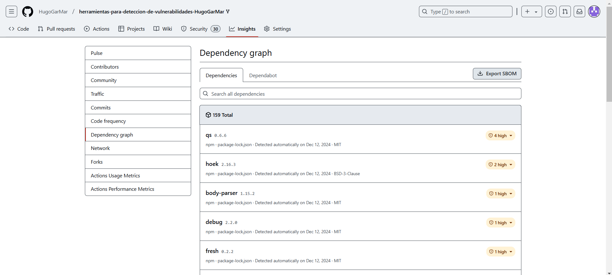
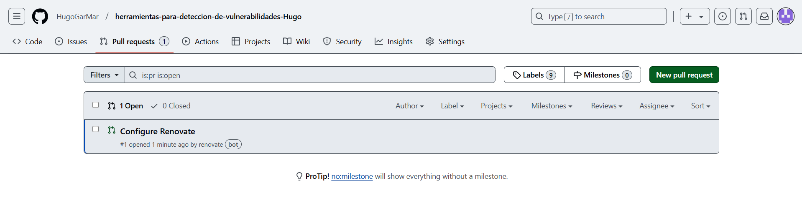
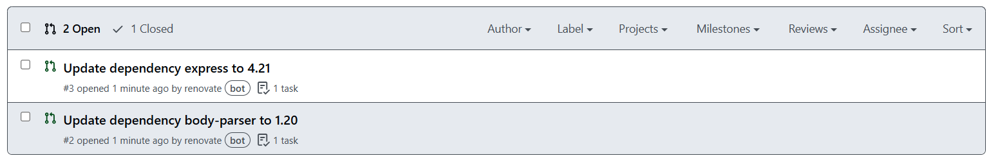
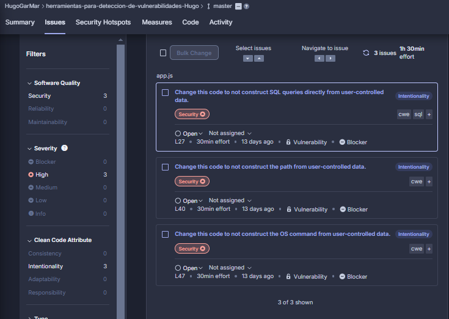
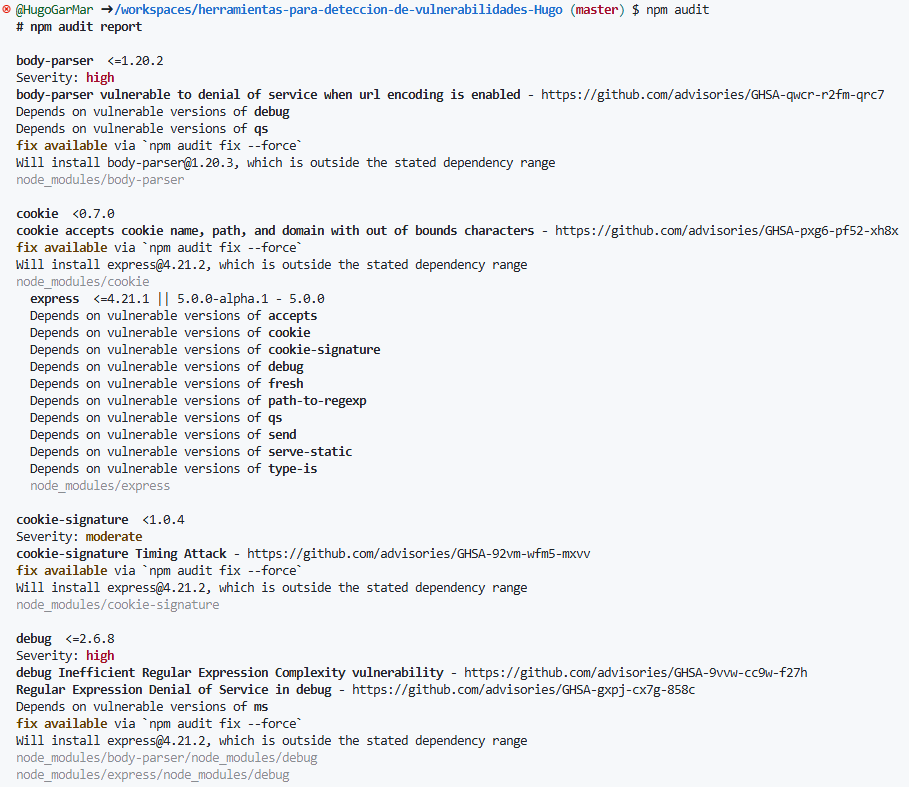
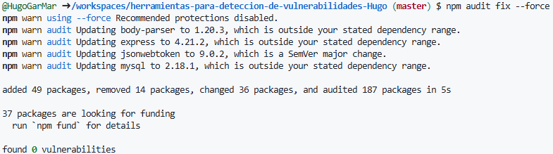
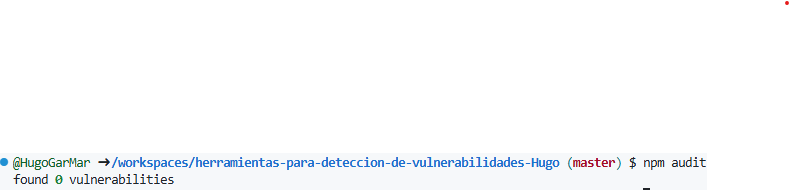

https://github.com/HugoGarMar/herramientas-para-deteccion-de-vulnerabilidades-Hugo.git
# Herramientas de análisis estático de código para detección de vulnerabilidades

## GitHub Dependabot

**1. Haz una captura de pantalla de las vulnerabilidades mostradas y comenta brevemente las vulnerabilidades que consideres que tienen más importancia.**
+ **qs:** Herramienta de análisis y construcción de cadenas de consulta.
+ **negotiator:** Es una biblioteca de Node.js que facilita la negociación de contenido HTTP entre el cliente y el servidor, para determinar el formato, idioma, codificación y tipo de contenido.
+ **hoek:** Es una biblioteca de utilidades para tareas como clonación de objetos, combinación, validación y manipulación de datos.
+ **cookie-signature:** Procesos de firmar y verificar la integridad de una cookie para asegurar que su contenido no ha sido manipulado.

## Renovate

+ La primera Pull Request de Renovate es una PR de configuración inicial.

+ La segunda Pull Request de Renovate actualiza el paquete body-parser de la versión `1.15` a la `1.20`

+ La tercera Pull Request actualiza el paquete express de la versión `4.0` a la `4.21`

## eslint
+ Ha detectado un "warning" en el fichero `/app.js`

## SonarQube

**1. Explica brevemente en qué consisten. Estos problemas, ¿están en el código de la aplicación o en alguna librería externa?**
+ 1 - Cambiar parte del código para no hacer directamente las consultas SQL desde datos controlados por el usuario
+ 2 - Cambiar código para no contruir la ruta a partir de datos controlados por el usuario
+ 3 - Cambiar código para no permitir que el usuario pueda saber las coordenadas del sistema operativo.

## npm audit
**1. Adjunta una captura de pantalla del resultado y comenta las sugerencias que realiza.**

+ Actualizar paquetes vulnerables: npm audit fix --force

**¿Cómo podrías corregir esas vulnerabilidades? Ejecuta el comando correspondiente para hacerlo pero no subas los cambios al repositorio. Haz una captura de pantalla del resultado del comando que corrige las vulnerabilidades. ¿Se han corregido?**
+ npm audit fix --force

## Preguntas finales
Para finalizar, contesta a las siguientes preguntas:

**1. Si quisieras detectar qué librerías o dependencias son vulnerables en tu proyecto, ¿qué herramientas de las estudiadas utilizarías?**
+ npm audit
+ Renovate
+ GitHub Dependabot

**Si quisieras detectar vulnerabilidades en el código propio del proyecto, ¿qué herramientas de las estudiadas utilizarías?**
+ SonarQube
+ eslint

